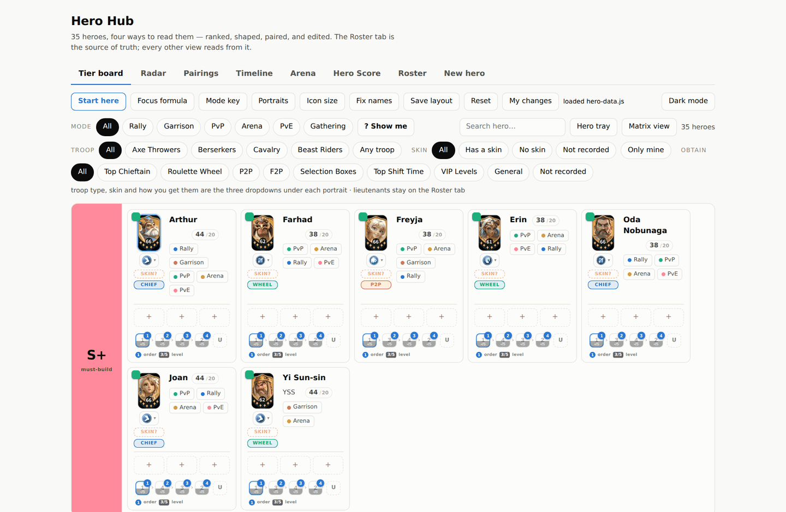
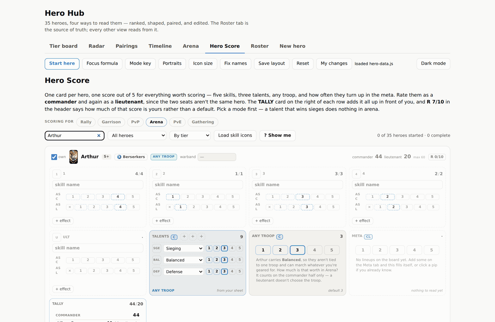
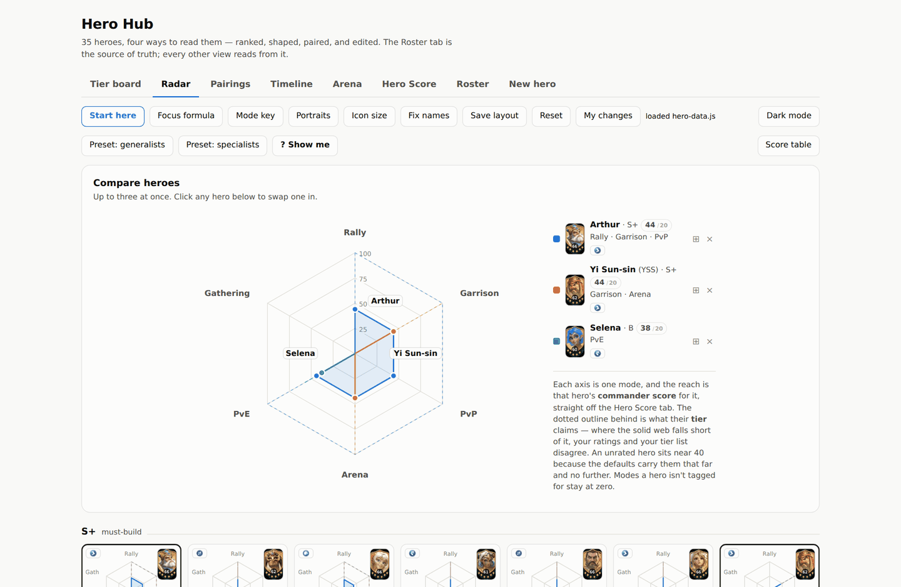
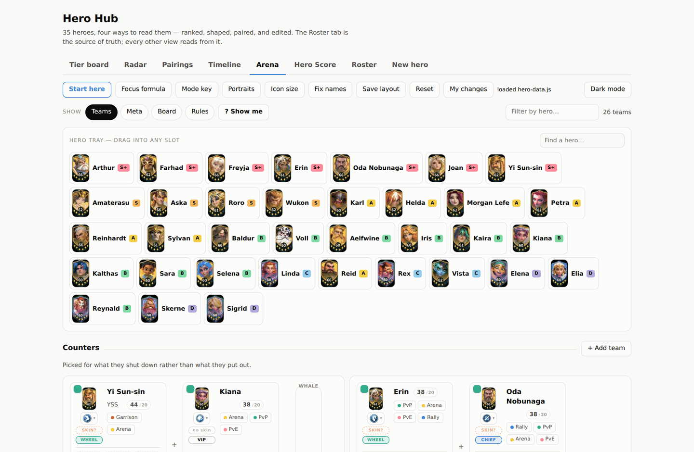
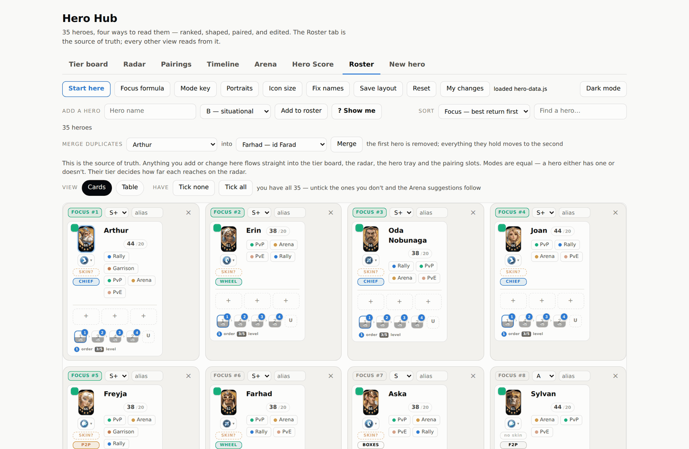
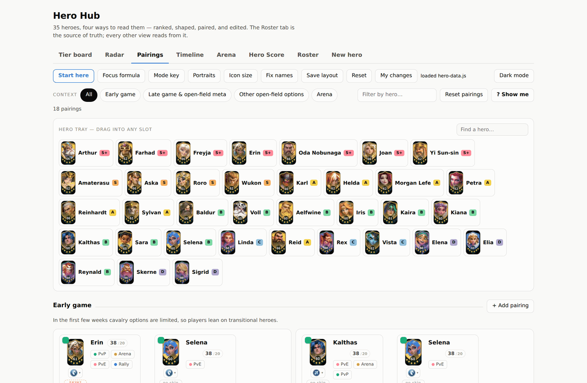
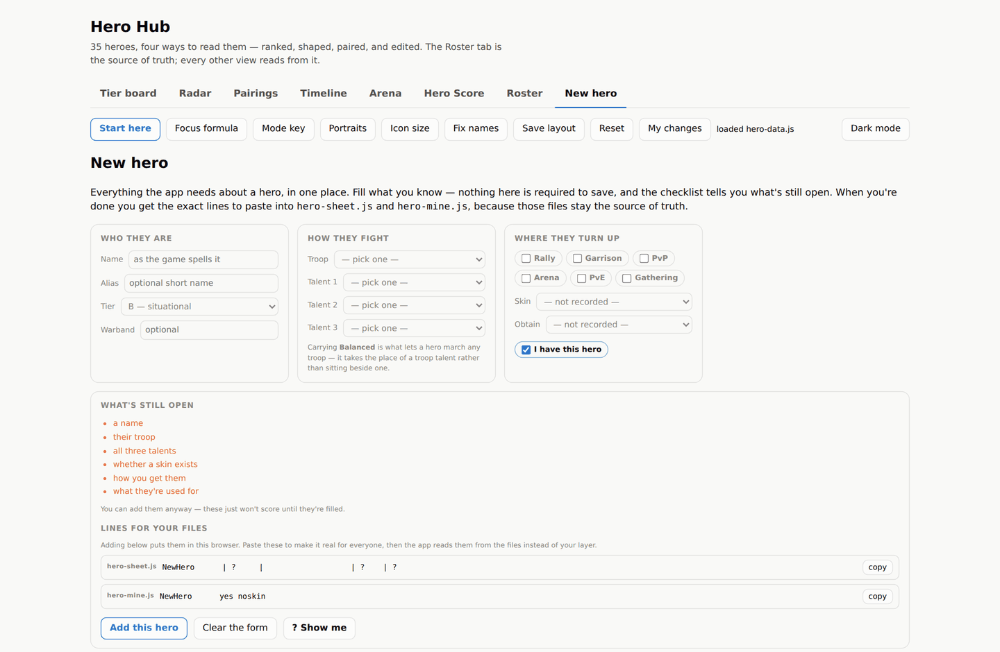
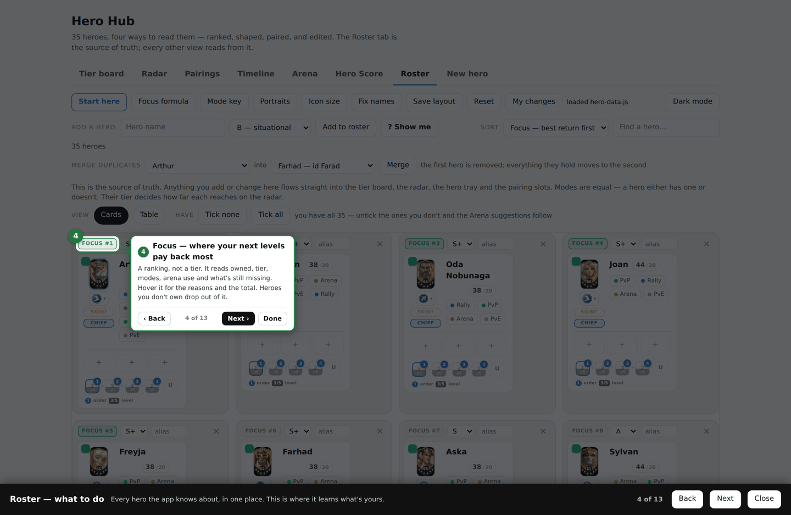

# Hero Hub

A hero planner for **Fate War** — ranks, ratings, arena counters and talent
builds — in **one HTML file**. No build step, no backend, no dependencies. Open
it from a folder or from a URL; it behaves the same either way.

**Live:** https://sidspanos.github.io/hero-hub/

---

## The idea

A tier list tells you a hero is good. It doesn't tell you *why*, or whether
that's still true for the mode you're actually playing, or whether they're
worth your next level given what you already own.

So Hero Hub keeps two opinions apart and lets them argue:

- **Your tier list** — the fast judgement, dragged around on a board.
- **Your ratings** — every skill, every talent, scored 1–5 *per game mode*,
  in the commander seat and the lieutenant seat separately.

Everything else in the app is built on the gap between those two.

---

## Eight tabs

| | |
|---|---|
| **Tier board** | Every hero S+ → D. Drag between tiers, filter by mode, troop, skin or how they're obtained. Each card carries the portrait, troop, skin, obtain method, three talent slots, the skill upgrade order and the hero's live score. |
| **Radar** | Six axes, one per mode. Reach is the hero's commander score; the dotted outline behind is what their tier claims. Where the solid web falls short, the two disagree. |
| **Pairings** | Who goes with whom outside the arena, grouped by situation, with your reasoning written underneath. |
| **Timeline** | Meta shifts by your own week number — who came in above the line, who dropped off below it. |
| **Arena** | Your teams, the enemy defences you keep meeting, a board to answer them on, and the positioning rules the suggestions are fired from. |
| **Hero Score** | The rating work. Ten values per hero per mode: five skills as commander and as lieutenant, three talents, any-troop, meta frequency. |
| **Roster** | The source of truth. Every hero in one editable table or as cards. |
| **New hero** | One form with everything the app scores on — and the two file lines that make a hero real for everyone, not just your browser. |

### Hero Score — where the numbers come from

A talent is worth nothing in the abstract. Sieging is a poor talent in the
arena and a fine one in a siege, so every value is stored **per mode**, and
scores are read against the mode you're looking at.

Talents pay in the **commander** seat only — a lieutenant brings their skills
and nothing else — so a hero has two scores, both out of the same 100, and the
lieutenant one has a lower ceiling on purpose.

Nothing starts blank. An unrated skill falls back to its place in your upgrade
order, because the skill you level first is the one you already decided matters
most. The `R 0/10` chip counts how many of the ten are your judgement rather
than a default, and turns green at ten.

### Radar — the tier list, argued with

The radar used to be computed from the tier alone, which meant it could never
disagree with the tier board — it was the same opinion drawn twice. Now each
axis is the commander score for that mode, with the tier value kept behind as a
dotted outline. A hero rated well below their tier shows it immediately.

Modes a hero isn't tagged for still read zero, so the shape keeps saying what a
hero is *for*, not only how good they are.

### Arena

Four sections. **Meta** is where you log the enemy defences you keep running
into — four columns by two rows, five tiles used, weighted by how many players
run each. **Teams** is what you own, tagged with what each reliably beats.
**Board** reads their half and proposes an answer for yours, working around
anything you've already placed. **Rules** is the positioning reference the
advice comes from, so the suggestions aren't a black box.

### Roster

Cards or a table, whichever suits. **Focus** ranks where your next levels,
stars and gear pay back most — it reads ownership, tier, modes, arena use and
what's still missing, and hovering a row shows the reasons and the total.

### Pairings

### Adding a hero

---

## Every tab explains itself

Every tab has a **`? Show me`** button. It dims the page and walks you through
that tab one highlight at a time, pointing at the real controls and measuring
them live — so it can't drift out of date the way a screenshot in a wiki does.

Red is something for you to do, green is something that fills itself, grey is
something to leave alone.

| Tab | Steps |
|---|---|
| Tier board | 4 |
| Radar | 10 |
| Pairings | 14 |
| Timeline | 2 |
| Arena | 20 |
| Hero Score | 9 |
| Roster | 13 |
| New hero | 14 |

Steps whose target isn't on the page right now drop out on their own and come
back when it appears — the four Pairings steps about unmatched names, for
instance, only show up when a name is actually unmatched.

---

## The files

Five files make the whole site, and each one owns a different kind of truth.

| File | What it holds | Published? |
|---|---|---|
| `index.html` | the entire app | yes |
| `hero-names.js` | `id → display name`, one per line | yes |
| `hero-sheet.js` | one line per hero: troop, three talents, skin, how you get them | yes |
| `skill-seq.js` | the order each hero's skills get trained | yes |
| `hero-data.js` | the saved layout, written by the app | yes |
| `hero-mine.js` | **your account** — which heroes you have | **no** |

They're read in that order, each one winning over the last, with your browser's
own edits on top of all of them.

`hero-mine.js` is in `.gitignore` and `publish.cmd` doesn't copy it. Nothing
breaks without it: a visitor simply starts owning all 35 heroes and unticks
their own. Same portraits, same talents, same training orders, same scores —
only ownership differs.

The left-hand side of `hero-names.js` is a stable id that never changes, so
renaming a hero never breaks anything pointing at them.

---

## Visitors keep their own version

Anyone using the site can re-tier heroes, rate them, log arena lineups and map
talent builds — and it stays **theirs**. Edits live in their own browser as a
layer on top of the published files and are never uploaded anywhere.

That layer is a **diff, not a copy**, which is what makes republishing safe:
push a new `hero-data.js` and someone who moved three heroes still has those
three moves, while everything they never touched picks up the new version.

**My changes** in the toolbar manages it — save a small JSON of just your
edits, load it on another machine, or drop the layer and go back to the
published version.

---

## Talent builds

Fifteen talent trees; every hero runs three of them. Click one of the three
slots on a card and the wheel opens — three colour-coded branches radiating
from the hero, laid out the way the game draws them.

Click nodes to take them. Everything leading to a node comes with it, and
clicking it again drops whatever was only reachable through it, so a build is a
few clicks rather than fourteen.

**Balanced** is the tree that isn't tied to a troop — a hero has a troop talent
*or* Balanced, never both — and carrying it scores separately as *any troop*.

---

## Running it

Nothing to install. Open `index.html`, or visit the live link. It works offline
once loaded, and from a plain folder on disk as well as over HTTP.

## Publishing

`DEPLOY.md` has the details. Short version: **Cloudflare Pages** connected to
this repo with no build command and `/` as the output directory, or GitHub
Pages from the same repo — both work, and both can run at once. On Windows,
`publish.cmd` copies the files out of the working folder, commits and pushes.

`_headers` tells Cloudflare not to cache, so a normal refresh always shows the
real build rather than yesterday's.

## Licence

MIT for the code. Hero artwork belongs to the game's publisher and is included
here only for personal reference.
